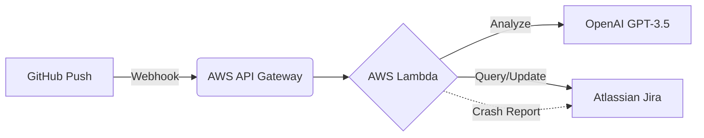

# DevSyncer: Enterprise Jira Automation


**DevSyncer** is a serverless integration layer that bridges the gap between Development (GitHub) and Project Management (Jira). It automatically tracks code changes, uses AI to generate non-technical summaries, and includes enterprise-grade features like **deduplication** and **self-reporting error logging**.

## 🏗 Architecture

The system runs entirely on AWS Serverless infrastructure to ensure zero maintenance and infinite scalability.



## ✨ Key Features

1. **AI-Powered Summaries:** Uses OpenAI (GPT-3.5) to translate technical commit messages into human-readable summaries for managers.
2. **Smart Deduplication:** Before creating a ticket, the system queries Jira to check if a task for the specific Commit ID already exists.
3. **Self-Healing Error Logging:** If the script crashes (e.g., API failure or syntax error), it catches its own traceback and creates a **Bug Ticket** in Jira assigned to the developer.
4. **Zero-Dependency:** Written in pure Python 3.12 using standard libraries (`urllib`, `json`, `os`), removing the need for complex Lambda Layers or ZIP uploads.

## 📂 Project Structure

This project is modularized into three core components for maintainability:

* `lambda_function.py`: **The Controller**. Orchestrates the workflow, handles the AWS event loop, and manages the crash reporting logic.
* `jira_helper.py`: **The Specialist**. Encapsulates all Jira REST API interactions, including the JQL search for duplicates and payload formatting.
* `ai_helper.py`: **The Brain**. Manages the connection to OpenAI and handles fallback logic if the AI service is unreachable.

## 🚀 Deployment Guide

### Prerequisites

* AWS Account (Lambda, API Gateway)
* Atlassian Jira Cloud Account (Email + API Token)
* OpenAI API Key

### Step 1: AWS Lambda Setup

1. Create a new Lambda function (Runtime: **Python 3.12**).
2. In the **Code Source** tab, create three separate files:
* `lambda_function.py`
* `jira_helper.py`
* `ai_helper.py`


3. Paste the respective code from this repository into each file.
4. Click **Deploy**.

### Step 2: Configuration (Environment Variables)

Go to **Configuration > Environment variables** and add the following:

| Variable | Description | Example |
| --- | --- | --- |
| `JIRA_DOMAIN` | Your Atlassian URL | `company.atlassian.net` |
| `JIRA_USER` | Your login email | `dev@company.com` |
| `JIRA_TOKEN` | Atlassian API Token | `ATATT3xFf...` |
| `OPENAI_KEY` | OpenAI Secret Key | `sk-proj-...` |
| `JIRA_PROJECT_KEY` | The Project Key for tickets | `KAN` |

### Step 3: API Gateway & Webhook

1. Add a Trigger to your Lambda function: **API Gateway** (Create new API, Open security).
2. Copy the generated **API Endpoint URL**.
3. Go to your GitHub Repository > **Settings** > **Webhooks**.
4. Add the URL, set Content-Type to `application/json`, and select "Just the push event".

## 🧪 Testing

You can simulate a webhook event locally using `curl`:

```bash
curl -X POST https://YOUR-AWS-API-URL \
     -H "Content-Type: application/json" \
     -d '{
           "head_commit": {
             "id": "a1b2c3d",
             "message": "feat: added login authentication middleware",
             "url": "[http://github.com/repo/commit/a1b2c3d](http://github.com/repo/commit/a1b2c3d)"
           },
           "pusher": { "name": "Razo" }
         }'

```

---

*Built by Razo.*

```

```